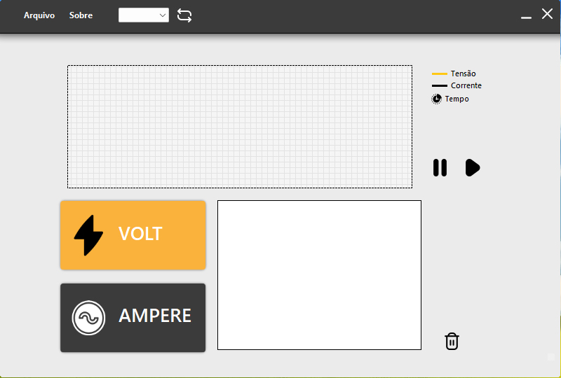
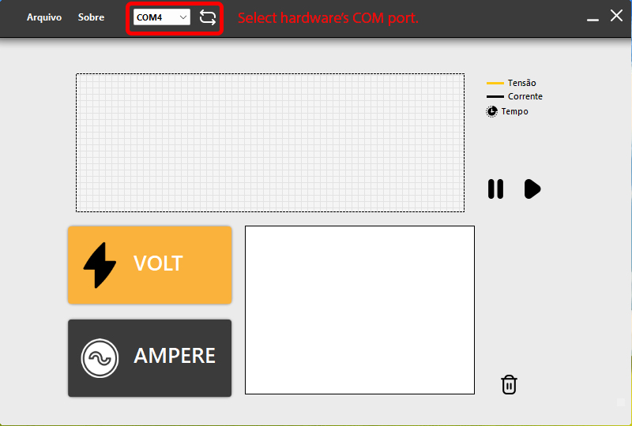
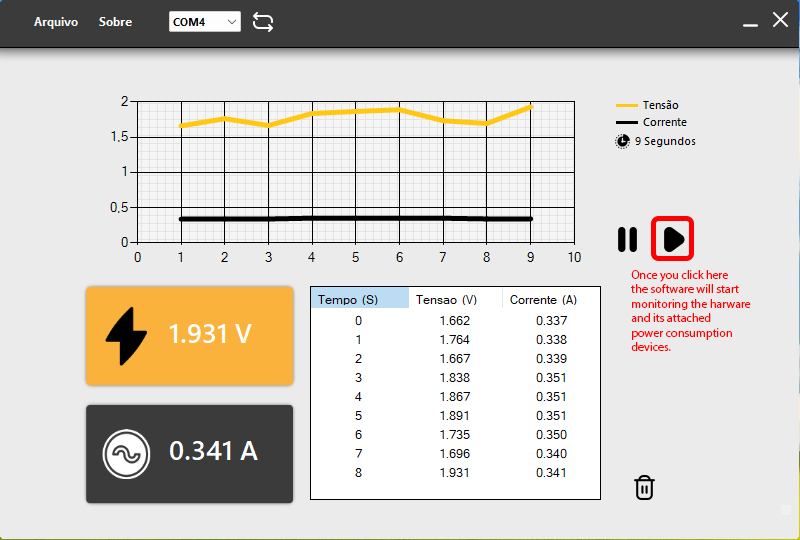
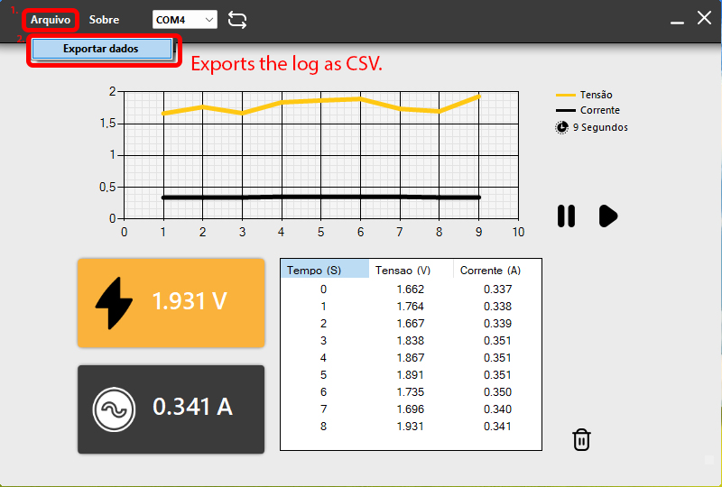
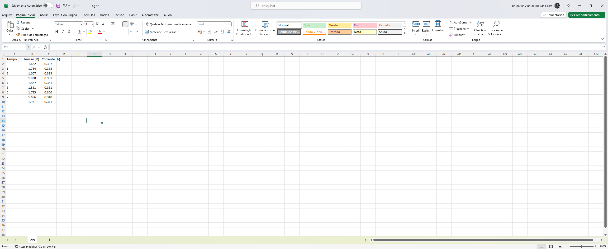

[WIP]
# Building the required Hardware:

Main Schematic for the hardware required to run the latest Hermes Volt Ampère Datalogger:

On this example, i used a simple Diode to represent the power consumer that we need to monitor Voltage and Current.
Replace this Diode with your own device.
 

Using ATMEGA328 and MAX471 IC.

After the assembly, upload any of the files included in "Upload to 328 Chip" folder.

Conect the Hardware to a Computer running Hermes A/V Datalogger, and start the software.

# Running Hermes Ampère Volt Datalogger

# Once you connected the harware

# Attach the power consumption

# Export the Log file as CSV

# Exported log example:
